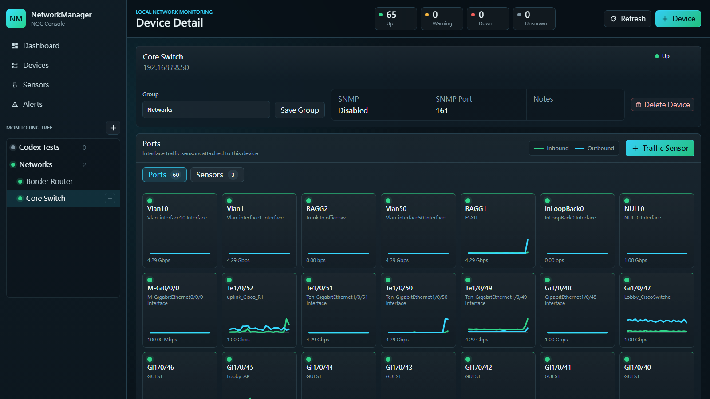

# NetworkManager

NetworkManager is a local NOC-style network monitoring console for small labs and office networks. It focuses on device inventory, ICMP checks, SNMP v2c sensors, and per-port traffic visibility in a PRTG-like workflow.



## What It Does

- Manages network devices and monitoring groups in a local SQLite database.
- Runs ICMP ping sensors and SNMP v2c GET sensors.
- Discovers switch/router interfaces through SNMP and creates per-port traffic sensors.
- Tracks inbound and outbound traffic with compact port tiles and detailed traffic charts.
- Stores sensor samples, last check status, and alert events locally.
- Lets users move devices between groups and manually position topology nodes.

## SNMP And Traffic Monitoring

NetworkManager supports custom SNMP OIDs for general sensors and a dedicated port workflow for interface traffic:

- SNMP guide includes common system OIDs and a Device Serial Number helper.
- Device Serial Number reads the first non-empty value from `1.3.6.1.2.1.47.1.1.1.1.11`.
- Port discovery reads interface names, descriptions, speeds, and high-capacity traffic counters.
- Duplicate OIDs and duplicate traffic ports are blocked per device.
- Ports are displayed as square tiles with status, interface name, description, speed, and mini traffic charts.

## Run Locally

```powershell
python server.py
```

Open:

```text
http://127.0.0.1:4173
```

The backend uses Python standard library modules and stores data in:

```text
data/network-manager.sqlite
```

## Current Status

This project is an active prototype. It already covers the core monitoring loop, local persistence, device/group management, ICMP, SNMP GET, SNMP port discovery, traffic samples, and traffic charting. Planned future work can build on this foundation with authentication, richer alert handling, search/filtering, and production deployment packaging.
